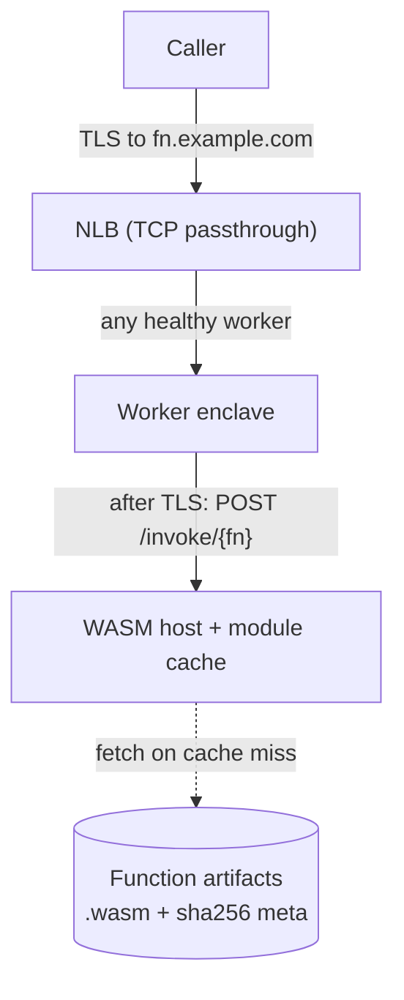

# nitrum-fn

Pay-per-invoke WASM functions on [Nitrum](https://github.com/nitrum) enclaves.

Develop, test, and run staging e2e: **[CONTRIBUTING.md](CONTRIBUTING.md)**.

`nitrum-fn` is the functions product that runs on Nitrum: developers publish `.wasm`, callers hit `POST /invoke/{fn}` over TLS that terminates **inside** the enclave, and the host runs the guest with Wasmtime. Nitrum stays the platform (EIF, TLS/ACME, attestation, ASG/NLB). This repo is the WASM host, catalog, CLI, and later payments.

## Features

- **Shared ingress.** Any healthy worker can serve any function. The NLB is TCP passthrough; after TLS, `POST /invoke/{fn}` selects the function. No subdomains, coordinator, or SNI routing.
- **TLS-in-enclave only.** The private key and plaintext request bodies never leave the enclave. Intermediaries (DNS, NLB) see ciphertext. Catalog, CLI, and later dashboards see metadata and code artifacts — never invoke payloads.
- **Fast path inside a long-lived enclave.** Scale by WASM instances, not by booting enclaves. In-memory Wasmtime `Module` and `Instance` caches absorb the cheap work (compile / instantiate). Enclave boot stays the expensive step and is treated as fleet capacity, not per-request.
- **Content-hash catalog.** Publish stores `.wasm` and queues AOT; the worker writes musl `.cwasm` and upserts the catalog. Invoke resolves a version label to that hash and deserializes the precompiled module (load-only).
- **Function SDK.** Guest code uses `Request` / `Response` runtime compiled *into* the `.wasm`, not into the host.
- **CLI-first.** Deploy and invoke are machine-native. No signup portal required for v1.
- **Observability before UI.** Invoke count, latency, traps, cold vs warm, and later 402/settle rates go through Nitrum’s OTel path (CloudWatch / Grafana).
- **Pay-per-invoke (planned).** [x402](https://www.x402.org/) gated **inside** the enclave after TLS — `402 Payment Required`, then retry with a payment proof. Facilitators see price metadata, never the body.
- **Platform AOT precompile (planned).** A platform-owned pipeline derives signed, hash-keyed artifacts from user `.wasm` so new workers deserialize instead of Cranelift-compiling. Users never upload native blobs.
- **Thin dashboard (last).** Browse functions, prices, and usage when humans need it — packaging on top of working publish / invoke / payment flows.

## Product shape

Nitrum is the enclave platform. `nitrum-fn` is the FaaS product on top of it.

| Nitrum (platform) | nitrum-fn (this repo) |
|---|---|
| EIF build, control-plane, data-plane TLS/ACME | WASM host (`/invoke`, module/instance cache) |
| Attestation, KMS DEK, egress, OTel plumbing | Function catalog, artifact store |
| `nitrum cloud deploy` / ASG / NLB | Deploy CLI, later x402 and pricing metadata |
| Optional later: platform hooks | Optional later: React dashboard, AOT build workers |

**Why a separate repo:** independent release cadence (avoid PCR0 churn on every host tweak), a clear product story, and room for CLI / catalog / payments without bloating the enclave toolkit.

### How a call lands



Any worker, any function. Density is bounded by how many warm modules fit in enclave RAM (tens to low hundreds of small guests; fewer if guests need hundreds of MiB).

### Crate layout

Hexagonal core (`domain` / `application` ports and use cases) with Nitrum-style capability crates. Only composition roots wire the concrete set.

```text
nitrum-fn/
├── crates/
│   ├── domain/          # FnId, Version, ContentHash, invoke/publish types
│   ├── application/     # ports + use cases (InvokeFunction, PublishFunction)
│   ├── executor/        # Wasmtime runner + in-memory module cache
│   ├── runtime/         # function SDK: Request/Response, run, service_fn
│   ├── catalog/         # name → version, sha256 (no bodies)
│   ├── artifacts/       # get/put .wasm by content hash
│   ├── host/            # enclave start_command — HTTP /invoke
│   ├── api/             # deploy / management (store + enqueue)
│   ├── publish-worker/  # SQS → AOT .cwasm + catalog upsert
│   ├── messaging/       # SNS publish bus / SQS consumer
│   ├── cli/             # talks to api (polls until ready)
│   └── payments/        # x402 (later)
└── examples/hello-world/
```

Trust rule: only the invoke path (`host` → `InvokeFunction` → `executor`) sees plaintext bodies. Publish / catalog / API are metadata and code artifacts only. `runtime` is linked into guest `.wasm`.

## Local development (S3 + DynamoDB)

Catalog rows live in DynamoDB (`fn_id` + `label` → content hash). `.wasm` / `.cwasm` artifacts live in S3. Publish events fan out on SNS to an SQS compile queue. For local store testing, run [Floci](https://floci.io) (S3 + SNS + SQS on `:4566`) and DynamoDB Local; run **api** (publish), **publish-worker** (AOT), and **host** (invoke).

```bash
# 1. Start Floci (:4566 S3+SNS+SQS) and DynamoDB Local (:8000)
docker compose up -d

# 2. Create the bucket, tables, topic, and queue (same shape as Terraform)
export AWS_REGION=us-east-1 AWS_ACCESS_KEY_ID=test AWS_SECRET_ACCESS_KEY=test
aws --endpoint-url http://127.0.0.1:4566 s3 mb s3://nitrum-fn
aws --endpoint-url http://127.0.0.1:8000 dynamodb create-table \
  --table-name nitrum-fn-catalog \
  --attribute-definitions AttributeName=fn_id,AttributeType=S AttributeName=label,AttributeType=S \
  --key-schema AttributeName=fn_id,KeyType=HASH AttributeName=label,KeyType=RANGE \
  --billing-mode PAY_PER_REQUEST
aws --endpoint-url http://127.0.0.1:8000 dynamodb create-table \
  --table-name nitrum-fn-catalog-idempotency \
  --attribute-definitions AttributeName=idempotency_key,AttributeType=S \
  --key-schema AttributeName=idempotency_key,KeyType=HASH \
  --billing-mode PAY_PER_REQUEST
aws --endpoint-url http://127.0.0.1:8000 dynamodb update-time-to-live \
  --table-name nitrum-fn-catalog-idempotency \
  --time-to-live-specification Enabled=true,AttributeName=expires_at
aws --endpoint-url http://127.0.0.1:4566 sqs create-queue \
  --queue-name nitrum-fn-compile \
  --attributes VisibilityTimeout=300,ReceiveMessageWaitTimeSeconds=20
QUEUE_ARN=$(aws --endpoint-url http://127.0.0.1:4566 sqs get-queue-attributes \
  --queue-url http://127.0.0.1:4566/000000000000/nitrum-fn-compile \
  --attribute-names QueueArn --query Attributes.QueueArn --output text)
TOPIC_ARN=$(aws --endpoint-url http://127.0.0.1:4566 sns create-topic \
  --name nitrum-fn-publish --query TopicArn --output text)
aws --endpoint-url http://127.0.0.1:4566 sns subscribe \
  --topic-arn "$TOPIC_ARN" --protocol sqs \
  --notification-endpoint "$QUEUE_ARN" \
  --attributes RawMessageDelivery=true

# 3. Run api + publish-worker + host against the emulators
# `config/{host,worker,api}/local.yaml` has Floci/DynamoDB values (`NITRUM_FN_ENV=local` by default).
export AWS_REGION=us-east-1 AWS_ACCESS_KEY_ID=test AWS_SECRET_ACCESS_KEY=test
cargo run -p publish-worker &
cargo run -p api &
cargo run -p host

# 4. Deploy to the API, invoke on the host (CLI polls until the worker catalogs the function)
cargo run -p cli -- deploy ./examples/hello-world/.../hello_world.wasm --name hello-world
curl -X POST http://127.0.0.1:8081/invoke/hello-world -H 'content-type: application/json' -d '{}'
```

End-to-end smoke: `bash tests/e2e/local.sh`. Full contributor workflow: [CONTRIBUTING.md](CONTRIBUTING.md).

**Observability** uses Nitrum’s OTel path — not a collector in this repo. The host exports OTLP (**gRPC** by default). Leave `OTEL_EXPORTER_OTLP_ENDPOINT` unset for stdout-only local runs.

## Cloud deploy

Staging Terraform lives in [`infra/`](infra/README.md). Fargate images default to GHCR (`ghcr.io/matzapata/nitrum-fn/api` and `…/publish-worker`, published by CI). Apply the API without enclaves first (`enable_enclave = false`), then the fleet once you have an EIF and PCR0. No custom DNS: publish is HTTP to the ALB; invoke is self-signed TLS on the NLB (`curl -k`). Ordered steps and `tests/e2e/cloud.sh`: [CONTRIBUTING.md](CONTRIBUTING.md#staging-e2e-cloud).

The enclave image is [`Dockerfile`](Dockerfile) (`nitrum build`). The Fargate API is [`Dockerfile.api`](Dockerfile.api); the publish worker is [`Dockerfile.publish-worker`](Dockerfile.publish-worker). Do not use `nitrum cloud deploy` — Terraform in this repo owns the stack.

## Stages

Each step is additive. Do not add a coordinator or gateway that terminates caller TLS and re-encrypts into the enclave.

| Stage | What ships | When |
|---|---|---|
| **1. Shared ingress** | WASM host, `/invoke`, catalog, artifacts, SNS→SQS AOT worker, deploy CLI, OTel metrics | Now — validate the contract on Nitrum |
| **2. x402 pay-per-invoke** | Payment gate inside the enclave after TLS; catalog holds price only; agents/scripts as callers | When monetization is the next product goal |
| **3. Platform precompile** | Extra SNS subscribers (signed artifacts, multi-target AOT) on the same publish topic | When product needs more than one compile consumer |
| **4. Thin dashboard** | React (or similar) for browse / price / usage | When humans, not agents, need a console |

```text
# Stage 1 — deploy and call
fn deploy ./echo.wasm --name echo
curl -X POST https://fn.example.com/invoke/echo -d '...'

# Stage 2 — same call, machine-native payment
fn deploy ./echo.wasm --name echo --price 0.01
curl -X POST https://fn.example.com/invoke/echo -d '...'
→ 402 + PAYMENT-REQUIRED
# client pays, retries with PAYMENT-SIGNATURE
→ 200 + result
```

Precompile extras (stage 3) do not change routing: still any healthy worker. A dashboard (stage 4) does not change the trust boundary: it never sees invoke payloads.