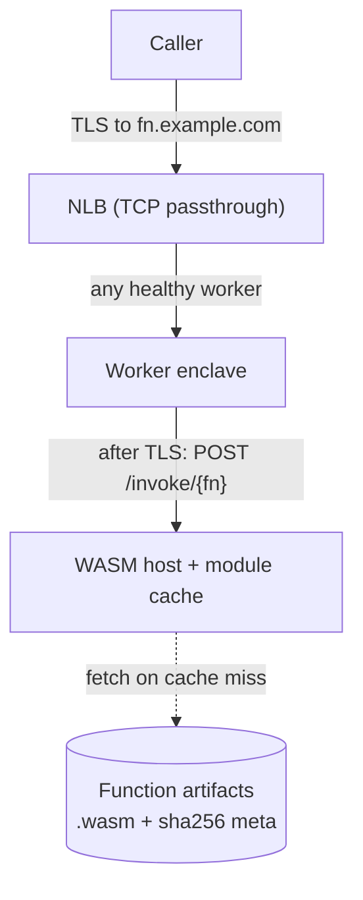

# nitrum-fn

WASM functions on [Nitrum](https://github.com/nitrum) enclaves.

Develop, test, and run staging e2e: **[CONTRIBUTING.md](CONTRIBUTING.md)**.

`nitrum-fn` is the functions product that runs on Nitrum: developers publish `.wasm`, callers hit `POST /invoke/{fn}` over TLS that terminates **inside** the enclave, and the host runs the guest with Wasmtime. Nitrum stays the platform (EIF, TLS/ACME, attestation, ASG/NLB). This repo is the WASM host, catalog, and CLI.

## Features

- **Shared ingress.** Any healthy worker can serve any function. The NLB is TCP passthrough; after TLS, `POST /invoke/{fn}` selects the function.
- **TLS-in-enclave only.** The private key and plaintext request bodies stay in the enclave. Intermediaries (DNS, NLB) see ciphertext. Catalog and CLI see metadata and code artifacts.
- **Fast path inside a long-lived enclave.** Scale by WASM instances. Enclave boot is fleet capacity.
- **Content-hash catalog.** Publish stores `.wasm` and queues AOT; the worker writes musl `.cwasm` and upserts the catalog. Invoke resolves a version label to that hash and deserializes the precompiled module (load-only).
- **Function SDK.** Guest code uses `Request` / `Response` runtime compiled *into* the `.wasm`.
- **CLI-first.** Deploy and invoke are machine-native.
- **Observability.** Invoke count, latency, traps, and cold vs warm go through Nitrum’s OTel path (CloudWatch / Grafana).

## Product shape

Nitrum is the enclave platform. `nitrum-fn` is the FaaS product on top of it.

| Nitrum (platform) | nitrum-fn (this repo) |
|---|---|
| EIF build, control-plane, data-plane TLS/ACME | WASM host (`/invoke`, module/instance cache) |
| Attestation, KMS DEK, egress, OTel plumbing | Function catalog, artifact store, AOT publish-worker |
| `nitrum cloud deploy` / ASG / NLB | Deploy CLI |

**Why a separate repo:** independent release cadence (PCR0 stays stable across host changes) and a focused product surface: WASM host, catalog, and CLI.

### How a call lands



Any worker, any function. Density is bounded by how many warm modules fit in enclave RAM (tens to low hundreds of small guests; fewer if guests need hundreds of MiB).

### Crate layout

Hexagonal core (`domain` / `application` ports and use cases) with Nitrum-style capability crates. Only composition roots wire the concrete set.

```text
nitrum-fn/
├── crates/
│   ├── domain/          # FnId, Version, ContentHash, invoke/publish types
│   ├── application/     # ports + use cases (InvokeFunction, PublishFunction)
│   ├── executor/        # Wasmtime runner
│   ├── runtime/         # function SDK: Request/Response, run, service_fn
│   ├── catalog/         # name → version, sha256 (no bodies)
│   ├── artifacts/       # get/put .wasm by content hash
│   ├── host/            # enclave start_command — HTTP /invoke
│   ├── api/             # deploy / management (store + enqueue)
│   ├── publish-worker/  # SQS → AOT .cwasm + catalog upsert
│   ├── messaging/       # SNS publish bus / SQS consumer
│   ├── telemetry/       # OTel init shared by bins
│   └── cli/             # talks to api (polls until ready)
└── examples/hello-world/
```

The invoke path (`host` → `InvokeFunction` → `executor`) sees plaintext bodies. Publish / catalog / API see metadata and code artifacts. `runtime` is linked into guest `.wasm`.

## Local development (S3 + DynamoDB)

Catalog rows live in DynamoDB (`fn_id` + `label` → content hash). `.wasm` / `.cwasm` artifacts live in S3. Publish events fan out on SNS to an SQS compile queue. For local store testing, run [Floci](https://floci.io) (S3 + SNS + SQS + DynamoDB on `:4566`); run **api** (publish), **publish-worker** (AOT), and **host** (invoke).

```bash
# 1. Start Floci (:4566) and provision the store
docker compose up -d --remove-orphans floci
docker compose run --rm aws-init

# 2. Run api + publish-worker + host against the emulators
# `config/shared/local.yaml` has Floci/DynamoDB values (`NITRUM_FN_ENV=local` by default).
export AWS_REGION=us-east-1 AWS_ACCESS_KEY_ID=test AWS_SECRET_ACCESS_KEY=test
cargo run -p publish-worker &
cargo run -p api &
cargo run -p host

# 3. Deploy to the API, invoke on the host (CLI polls until the worker catalogs the function)
cargo run -p cli -- deploy ./examples/hello-world/.../hello_world.wasm --name hello-world
curl -X POST http://127.0.0.1:8081/invoke/hello-world -H 'content-type: application/json' -d '{}'
```

End-to-end smoke: `bash tests/e2e/local.sh`. Full contributor workflow: [CONTRIBUTING.md](CONTRIBUTING.md).

**Observability** uses Nitrum’s OTel path. Long-running bins always log to stdout; when `OTEL_EXPORTER_OTLP_ENDPOINT` is set they also export traces, metrics, and logs over OTLP (**gRPC** by default). Leave the endpoint unset for stdout-only local runs. In staging, Fargate api/worker and the Nitro host run an ADOT collector that writes EMF metrics to a shared `/nitrum/<project>/metrics` log group (optional X-Ray via `enable_xray_tracing`). HTTP latency uses `http.server.request.duration`.

## Cloud deploy

Staging Terraform lives in [`infra/`](infra/README.md). Fargate images default to GHCR (`ghcr.io/matzapata/nitrum-fn/api` and `…/publish-worker`, published by CI). Apply the API first (`enable_enclave = false`), then the fleet once you have an EIF and PCR0. Publish is HTTP to the ALB; invoke is self-signed TLS on the NLB (`curl -k`). Ordered steps and `tests/e2e/cloud.sh`: [CONTRIBUTING.md](CONTRIBUTING.md#staging-e2e-cloud).

The enclave image is [`Dockerfile`](Dockerfile) (`nitrum build`). The Fargate API is [`Dockerfile.api`](Dockerfile.api); the publish worker is [`Dockerfile.publish-worker`](Dockerfile.publish-worker). Terraform in this repo owns the stack.
