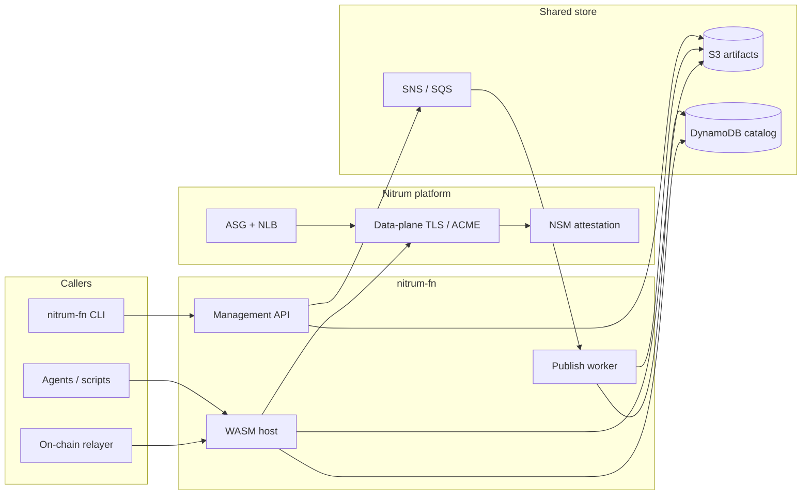
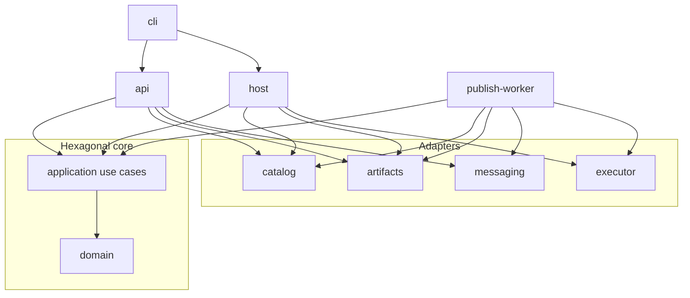
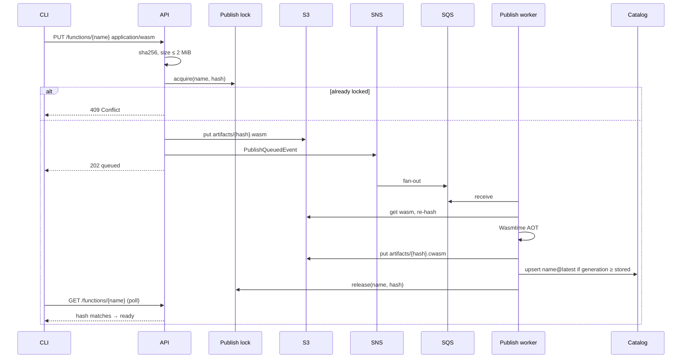
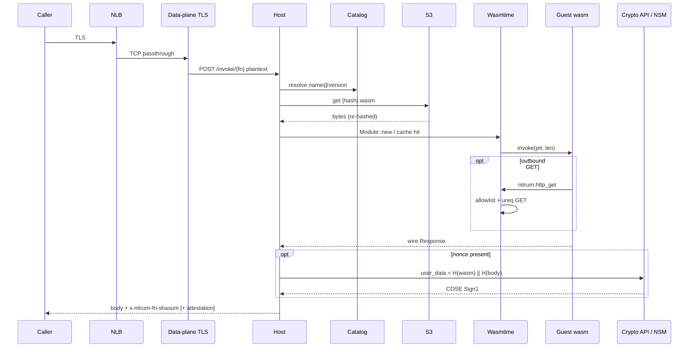
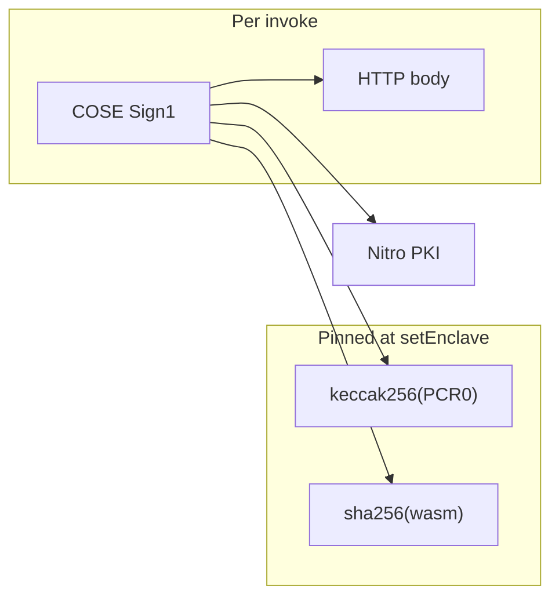

# Architecture

`nitrum-fn` is a pay-per-invoke WASM functions product that runs on [Nitrum](https://github.com/matzapata/nitrum) Nitro enclaves. Developers publish a `.wasm`. Callers hit `POST /invoke/{fn}` over TLS that terminates **inside** the enclave. The host runs the guest in Wasmtime.

Nitrum is the platform (EIF, TLS, attestation, ASG/NLB, KMS). This repo is the WASM host, catalog, publish pipeline, CLI, and later payments.




## Trust model

The split is the product:


| Path              | Who                               | Sees plaintext invoke bodies?        |
| ----------------- | --------------------------------- | ------------------------------------ |
| Publish / catalog | API, worker, CLI, later dashboard | No — metadata and `.wasm` bytes only |
| Invoke            | Host inside the enclave           | Yes — after TLS termination          |


Rules that follow:

- Intermediaries (DNS, NLB) see ciphertext. The NLB is TCP passthrough.
- TLS private key never leaves the enclave.
- Any healthy worker can serve any function after TLS. There is no SNI routing, subdomain map, or coordinator.
- The host re-hashes `.wasm` bytes from S3 before compiling. Catalog rows are a pointer, not a trust root.
- Unsigned `.cwasm` from the publish worker is **not** deserialized on invoke. AOT exists so publish can declare “ready”; the trusted execute path is still verified wasm → Cranelift in the enclave.
- Attestation `user_data` binds both the guest image and the HTTP response body: `sha256(wasm) || sha256(body)`.

```mermaid
flowchart TB
  Client[Caller]
  NLB[NLB TCP passthrough]
  Enc[Worker enclave]
  TLS[TLS terminate]
  Wasm[Wasmtime + module cache]
  S3[(artifacts/{hash}.wasm)]

  Client -->|"ciphertext"| NLB
  NLB --> Enc
  Enc --> TLS
  TLS -->|"plaintext POST /invoke/{fn}"| Wasm
  Wasm -.->|"cache miss: get + re-hash"| S3
```


Density is bounded by warm modules in enclave RAM, not by booting an enclave per request. Enclave boot is fleet capacity.

## Cloud topology

Staging Terraform lives in `infra/`. Publish and invoke are different load balancers on purpose.

```mermaid
flowchart TB
  subgraph public [Public]
    ALB[ALB HTTP]
    NLB[NLB TCP 443]
  end

  subgraph vpc [VPC]
    subgraph fargate [Fargate]
      API[nitrum-fn-api]
      PW[nitrum-fn-publish-worker]
    end
    subgraph asg [ASG]
      CP[Nitrum control-plane]
      DP[Nitrum data-plane]
      Host[nitrum-fn-host]
    end
  end

  subgraph aws [AWS]
    S3[(artifacts + EIF buckets)]
    DDB[(catalog + publish-lock)]
    SNS[SNS publish topic]
    SQS[SQS compile queue]
    KMS[KMS PCR0-conditioned]
  end

  Publisher[Publisher] -->|PUT /functions/{name}| ALB
  Caller[Caller] -->|TLS| NLB
  ALB --> API
  NLB --> DP
  DP --> Host
  API --> S3
  API --> DDB
  API --> SNS
  SNS --> SQS
  SQS --> PW
  PW --> S3
  PW --> DDB
  Host --> S3
  Host --> DDB
  Host --> KMS
  CP --> S3
```


| Surface           | Where                   | Protocol                             |
| ----------------- | ----------------------- | ------------------------------------ |
| Publish / catalog | Fargate behind an ALB   | HTTP (`api_url`)                     |
| Invoke            | Nitro ASG behind an NLB | HTTPS, TLS in-enclave (`invoke_url`) |
| AOT compile       | Fargate worker, musl    | SQS long-poll                        |


`project_name` must equal `[project].name` in the root `nitrum.toml` (`nitrum-fn`). Environment is account + DNS overlay (`NITRUM_FN_ENV=staging|prod`), not a second project slug.

The enclave image is `Dockerfile` (`nitrum build`). It is **not** deployed with `nitrum cloud deploy`; this repo’s Terraform owns the stack. Root `nitrum.toml` configures the **host** workload (port, start command, TLS, platform egress). Function allowlists are a separate guest config — see [usage.md](usage.md).

## Components


### CLI (`crates/cli`, binary `nitrum-fn`)

Talks to the API and the host. It never runs wasm.


| Command    | Role                                                               |
| ---------- | ------------------------------------------------------------------ |
| `deploy`   | `PUT` the `.wasm`, then poll `GET` until the catalog hash matches  |
| `describe` | sha256 of a local `.wasm` (same value as `x-nitrum-fn-shasum`)     |
| `invoke`   | `POST /invoke/{name}`; optional hash pin, PCR0, attestation verify |


### Management API (`crates/api`)

Fargate composition root. Hexagonal use case: `PublishFunction`.


| Method | Path                | Purpose                                       |
| ------ | ------------------- | --------------------------------------------- |
| `GET`  | `/healthz`          | Liveness                                      |
| `PUT`  | `/functions/{name}` | Store wasm, acquire publish lock, enqueue SNS |
| `GET`  | `/functions/{name}` | Resolve `latest` (hash + egress allowlist)    |


`PUT` returns `202` with `status: "queued"`. The function is not invokable until the worker upserts the catalog. Concurrent publish of the same name is `409`.

Allowlist travels as repeated `x-nitrum-fn-allow-url` headers, not in the wasm body.

### Publish worker (`crates/publish-worker`)

Fargate / local consumer. Hexagonal use case: `CompileQueuedFunction`.

1. Long-poll SQS.
2. Load `{hash}.wasm` from S3 and re-hash.
3. Wasmtime AOT → `{hash}.cwasm` (musl, so the blob matches the enclave toolchain). Skip if `.cwasm` already exists.
4. Upsert catalog `name@latest` if `queued_at_ms` is not stale.
5. Release the per-function publish lock.

A newer generation wins: catalog `PutItem` is conditioned on `queued_at_ms`. A late worker still writes `.cwasm` and drops **its** lock, but does not clobber a newer catalog row.

After rolling a new **worker** image, republish functions so `.cwasm` is rebuilt for that Wasmtime.

### Host (`crates/host`)

Enclave `start_command`. Hexagonal use case: `InvokeFunction`.

- `GET /healthz`
- `POST /invoke/{name}` — body limit 1 MiB
- Optional `x-nitrum-fn-version` (default `latest`)
- Optional `x-nitrum-fn-nonce` (16–32 bytes, base64) → mint attestation
- Always sets `x-nitrum-fn-shasum` to sha256 of the wasm it compiled

Local (`NITRUM_FN_ENV=local`): `NoopAttestor` — no Nitro document. Cloud: `NitrumCryptoAttestor` calls the data-plane loopback `POST http://127.0.0.1:3000/attestation`.

### Executor (`crates/executor`)

Wasmtime runner shared by host (invoke) and worker (AOT).

Guest ABI v0:

- export `memory`
- export `invoke(ptr, len) -> len`
- import `nitrum.http_get(url_ptr, url_len, out_ptr, out_cap) -> len_or_err`

The host places a JSON wire request at offset 64, calls `invoke`, and reads the wire response from the same pointer. Epoch interruption enforces the 15s wall-clock deadline. Linear memory is capped at 64 MiB.

`http_get` is GET-only, HTTPS-only, no redirects, 3s timeout, 256 KiB body. Origin must match the function’s catalog allowlist. Empty allowlist denies all egress.

### Runtime SDK (`crates/runtime` + `crates/runtime-macros`)

Linked **into the guest** `.wasm`, not into the host. `#[runtime::main]` generates the `invoke` export and lazy-registers the handler on first call. Sync and `async` handlers are both supported; async is polled to completion with a tiny guest executor (`block_on`). Outbound `Client::get(url).send().await` is a host import that completes on first poll.

### Catalog (`crates/catalog`)

DynamoDB items: `fn_id` (hash) + `label` (range) → `content_hash`, `queued_at_ms`, `egress_allow`.

No request bodies. The catalog is a name → hash map plus egress policy.

### Artifacts (`crates/artifacts`)

One S3 bucket, keys `artifacts/{sha256}.wasm` and `artifacts/{sha256}.cwasm`. `get` re-hashes wasm bytes and rejects mismatch.

### Messaging (`crates/messaging`)

SNS `PublishBus` on accept; SQS consumer for the worker. Payload is `PublishQueuedEvent` (`function`, `content_hash`, `wasm_bytes`, `queued_at_ms`, `egress_allow`).

### Domain / application (`crates/domain`, `crates/application`)

Pure types and use cases. Ports: `FunctionCatalog`, `ArtifactStore`, `FunctionRunner`, `PublishBus`, `PublishLock`, `CompileQueue`, `FunctionAttestor`. Only composition roots (`api`, `host`, `publish-worker`) wire AWS / Wasmtime.




Trust rule in crate terms: only `host` → `InvokeFunction` → `executor` sees plaintext bodies. `runtime` is not on that path; it is compiled into user wasm.

## Publish pipeline




`latest` is the only label written today. Invoke may still send `x-nitrum-fn-version`; unknown labels 404.

## Invoke pipeline




Module compile is cached in-process by content hash. Instance is per-request (fresh store, limiter, epoch deadline).

## Guest ABI and wire format

Host and guest speak JSON, not raw HTTP, across the Wasmtime boundary:

```json
{"method":"POST","path":"/invoke/oracle","headers":[["content-type","application/json"]],"body_base64":"..."}
```

```json
{"status":200,"headers":[["content-type","application/json"]],"body_base64":"..."}
```

The HTTP host maps that back to a real status, headers, and body. Guest `Err` becomes HTTP 500 `{"error":"..."}`. Guest `Response` with a 4xx status is returned as-is (the oracle uses this for validation errors).

Outbound fetch uses a second envelope `{ "status", "body_base64" }` written into guest memory by `http_get`.

## Attestation

On a successful invoke with a valid nonce, the host asks Nitrum for an NSM document:

```
user_data[0..32]  = sha256(wasm bytes compiled)
user_data[32..64] = sha256(HTTP response body)
nonce             = caller-supplied 16..=32 bytes
PCR0              = EIF measurement (48 bytes)
```

The CLI (`--pcr0` + `--fn-shasum`) verifies with `nitrum-verify`: AWS Nitro root, PCR0 pin, nonce, max age 5 minutes, then the 64-byte `user_data` split.

On-chain consumers (see [usage.md](usage.md#on-chain-verification)) re-check the same four facts after Nitro PKI:

1. AWS Nitro root CA
2. `keccak256(raw PCR0) == pcr0Hash`
3. `user_data[0:32] == contentHash` (sha256 of the guest wasm — **not** AWS PCR1)
4. `user_data[32:64] == sha256(body)`




Local host never mints a document. On-chain submit needs staging (or prod) enclaves.

## Config overlays

Long-running bins load YAML, then `NITRUM_FN_*` env (`__` nests):

```
config/shared/base.yaml
config/shared/{NITRUM_FN_ENV}.yaml
config/{api|host|worker}/base.yaml
config/{api|host|worker}/{NITRUM_FN_ENV}.yaml
NITRUM_FN_* environment
```

Default `NITRUM_FN_ENV` is `local`. The enclave gets the overlay from SSM after the data-plane clears process env. Bucket and table **names** are literals in `config/shared/{staging,prod}.yaml`; Terraform `yamldecode`s the same files. Account-specific ARNs (SNS, SQS) still come from ECS env.

Host config is resolved next to the binary so the EIF does not depend on cwd.

## Local topology

Compose runs **emulators only** (Floci: S3 + SNS + SQS + DynamoDB on `:4566`). `api`, `host`, and `publish-worker` stay on `cargo run`.


| Process | Default port |
| ------- | ------------ |
| API     | 8080         |
| Host    | 8081         |
| Floci   | 4566         |


Same use cases and adapters as cloud; attestation is a no-op.

## Observability

`crates/telemetry` owns process-wide init. Bins always log to stdout. When `OTEL_EXPORTER_OTLP_ENDPOINT` is set they also export traces, metrics, and logs (gRPC by default). Staging Fargate and the Nitro host run an ADOT collector that writes EMF to `/nitrum/<project>/metrics`. HTTP latency is `http.server.request.duration`. Product/business metrics are not defined yet.

## Limits (product, 0.1)


| Limit                 | Value                |
| --------------------- | -------------------- |
| `.wasm` upload        | 2 MiB                |
| Invoke HTTP body      | 1 MiB                |
| Guest `invoke` output | 1 MiB                |
| Guest linear memory   | 64 MiB               |
| AOT `.cwasm`          | 16 MiB               |
| Invoke wall clock     | 15 s                 |
| Egress origins        | 8                    |
| Outbound URL          | 2048 bytes           |
| Outbound GET body     | 256 KiB              |
| Outbound GET timeout  | 3 s                  |
| Function name         | 1–64 `[A-Za-z0-9_-]` |


