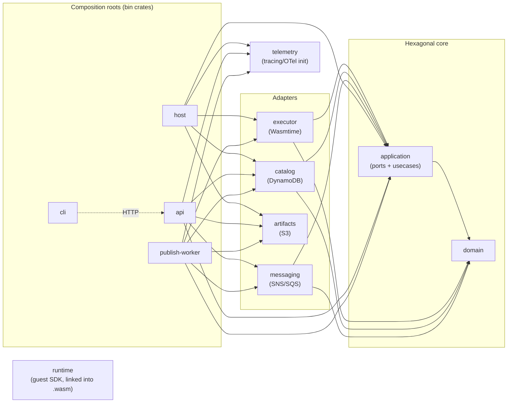
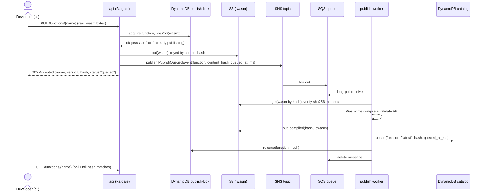
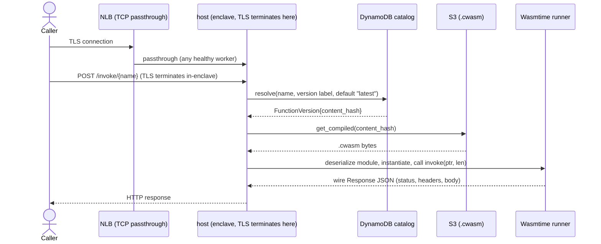
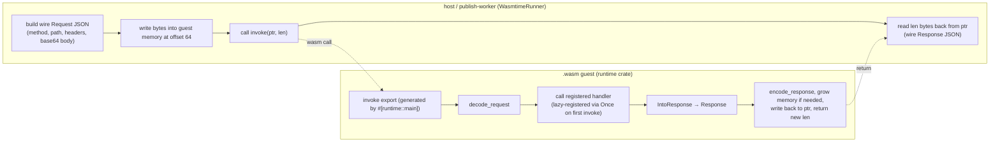
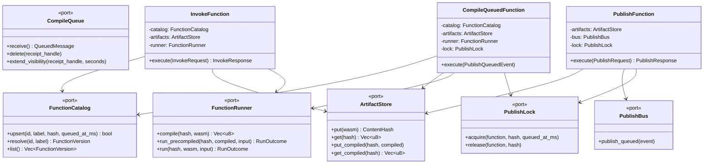
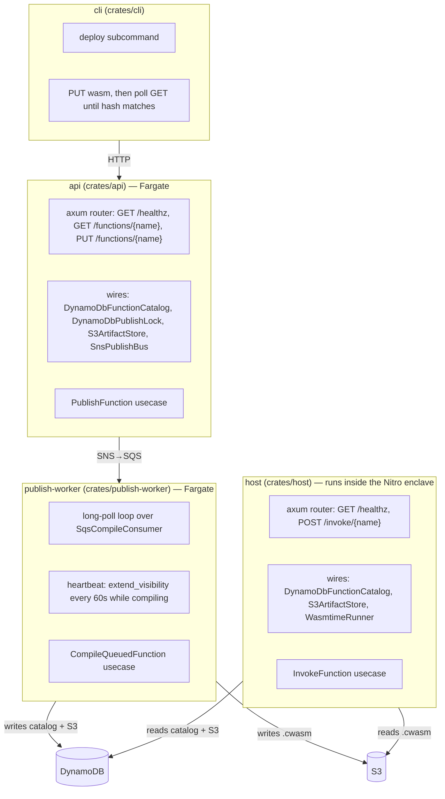

# Architecture

`nitrum-fn` is a hexagonal Rust workspace: a pure `domain` crate, an `application` crate of ports + use cases, and adapter crates (`executor`, `catalog`, `artifacts`, `messaging`) wired together by four composition-root binaries (`host`, `api`, `publish-worker`, `cli`). This document describes the crate graph, request paths, guest ABI, and trust boundary.

## Crate graph



`domain` has no dependency on any other crate in the workspace. `application` depends only on `domain`. Adapters depend on `application` + `domain` to implement its ports. Only the bin crates (`host`, `api`, `publish-worker`, `cli`) wire concrete adapters together.

## Request paths

There are two independent flows: **publish** (async, via api → SNS/SQS → publish-worker) and **invoke** (sync, via host). They only meet at the DynamoDB catalog and S3 artifact store.

### Publish



- The publish lock is per `FunctionId`, held from `PUT` accept until the worker calls `release`. A second publish for the same function while one is in flight gets `409 Conflict`. The lock row also carries a `queued_at_ms` generation and a ~15 minute TTL so a dead worker cannot block publishes forever.
- The catalog `upsert` is generation-guarded: it rejects an update whose `queued_at_ms` is older than what's already stored, so an out-of-order retry cannot overwrite a newer publish.
- If a `.cwasm` already exists for that content hash (e.g. reprocessed message), the worker skips recompiling and just upserts the catalog.
- `cli deploy` (see [usage.md](usage.md)) wraps this into one command: `PUT` the wasm, then poll `GET /functions/{name}` until its hash matches.

### Invoke



- Invoke is **load-only**: it deserializes the precompiled `.cwasm` produced at publish time. A missing `.cwasm` is `AppError::ArtifactMissing`.
- `x-nitrum-fn-version` header selects a version label; if absent, `VersionLabel::latest()` is used.
- The `NLB` is TCP passthrough. After TLS terminates inside the enclave, the function name is taken from the URL path. Any healthy worker can serve any function.

## Guest ABI and the wire protocol

Every guest `.wasm` module built with `runtime` exports exactly two things:

- `memory`
- `invoke(ptr: i32, len: i32) -> i32`



- `#[runtime::main]` (a proc macro in `runtime-macros`) generates the `#[no_mangle] extern "C" fn invoke` export. The first call registers the wrapped function as the handler (`std::sync::Once`).
- Request/response bytes crossing the ABI boundary are JSON with base64-encoded bodies (`WireRequest` / `WireResponse` in `runtime::wire`), not raw HTTP bytes.
- Handler signatures look like `fn handler(req: Request) -> Result<T, Error>` where `T` implements `IntoResponse` (built-in impls exist for `serde_json::Value`, `String`, `&str`, `Vec<u8>`, and `Response` itself).
- On the host side (`executor::WasmtimeRunner`), the same JSON+base64 wire format is written into and read out of guest linear memory. Method, path, headers, and body come from the `axum` request.

## Wasmtime sandboxing (`executor`)

`WasmtimeRunner` (`crates/executor/src/wasmtime_runner.rs`) is the only place `.wasm`/`.cwasm` bytes are executed:

- **ABI validation at compile time.** `Module::new` + `assert_abi` require exports `memory` and `invoke(i32, i32) -> i32` with that signature. Validation runs before instantiate.
- **Wall-clock deadline via epoch interruption.** A dedicated `wasmtime-epoch` thread calls `engine.increment_epoch()` on a fixed tick (`EPOCH_TICK` = 10ms). Each store's deadline is set to `INVOKE_TIMEOUT` (5s) worth of ticks; exceeding it traps as `Trap::Interrupt`, which the runner maps to `AppError::Timeout`.
- **Resource limits.** `StoreLimits` caps guest linear memory at `MAX_GUEST_MEMORY_BYTES` (64 MiB) and restricts the store to 1 instance / 1 memory / 1 table.
- **Signal-free traps.** Spectre mitigations and signal-based traps are off; memory guard regions are zero. Nitro enclaves have a ~4 GiB address space; Wasmtime's 64-bit defaults reserve several GiB of virtual address space per memory plus guard pages.
- **Two run paths**, both behind the same `FunctionRunner` port: `run` (compile raw `.wasm` then invoke — used in the executor's tests) and `run_precompiled` (deserialize a host-serialized `Module` — used by `InvokeFunction`). `compile` validates and serializes a module for storage. `run_precompiled` deserializes the `.cwasm` on every invoke.

## Domain types and limits

`domain` defines the value types shared by every layer, with validation in their constructors:

- `FunctionId` — 1–64 chars, `[A-Za-z0-9_-]` only.
- `VersionLabel` — 1–64 chars; `VersionLabel::latest()` is the default label resolved when a request has no `x-nitrum-fn-version` header.
- `ContentHash` — sha256 of the raw `.wasm` bytes, the identity used across catalog rows, S3 keys, and publish-lock rows.
- `FunctionVersion` — a resolved `(FunctionId, VersionLabel, ContentHash)` triple, the catalog's return type.
- `PublishQueuedEvent` — the message shape on the wire between `api` and `publish-worker` (function name, hex content hash, wasm byte count, `queued_at_ms` generation).

Fixed product limits (`crates/domain/src/limits.rs`), enforced at the use-case / executor layer, not just at the HTTP edge:

| Constant | Value | Enforced where |
|---|---|---|
| `MAX_WASM_BYTES` | 2 MiB | `PublishFunction::execute`, `CompileQueuedFunction::execute` |
| `MAX_INVOKE_BODY_BYTES` | 1 MiB | `host` HTTP layer + `WasmtimeRunner::invoke_sync` |
| `MAX_GUEST_OUTPUT_BYTES` | 1 MiB | `WasmtimeRunner::invoke_sync` (checked against the guest's returned length before reading memory) |
| `MAX_GUEST_MEMORY_BYTES` | 64 MiB | `StoreLimits` in `WasmtimeRunner::new_store` |
| `MAX_COMPILED_BYTES` | 16 MiB (8× wasm max) | documented limit for `.cwasm` artifact size |
| `INVOKE_TIMEOUT` | 5s | Wasmtime epoch deadline |
| `EPOCH_TICK` | 10ms | epoch ticker interval |

## Application layer: ports and use cases



Three use cases live in `application::usecases`, each a struct holding `Arc<dyn Port>` trait objects:

- **`InvokeFunction`** — resolve version → `get_compiled` → `run_precompiled`. Deserialize failures and traps are returned as errors.
- **`PublishFunction`** — validates size, hashes the wasm, `acquire`s the per-function lock, `put`s the artifact, `publish_queued`s the event. If either `put` or `publish_queued` fails, the lock is released so a later retry isn't blocked.
- **`CompileQueuedFunction`** — the worker-side use case invoked per SQS message: skip compiling if a `.cwasm` for that hash already exists, otherwise fetch the raw wasm, re-verify its sha256 against the event's claimed hash (`AppError::HashMismatch` if they disagree), compile, store the `.cwasm`, generation-guarded catalog `upsert`, then release the lock regardless of whether the upsert was applied or stale.

`AppError` (`application::error`) is the single error type returned by every use case. `public_message()` maps `Invoke`, `Trap`, and `Storage` to `"internal error"` on HTTP responses; logs keep the full `Display`.

## Adapters

| Port | Adapter crate | Backing service | Notes |
|---|---|---|---|
| `FunctionCatalog` | `catalog::DynamoDbFunctionCatalog` | DynamoDB | `fn_id` + `label` → content hash rows |
| `PublishLock` | `catalog::DynamoDbPublishLock` | DynamoDB | conditional `put_item`/`delete_item`; TTL attribute `expires_at` (~15 min) |
| `ArtifactStore` | `artifacts::S3ArtifactStore` | S3 | `.wasm` and `.cwasm` objects keyed by content hash under a configurable prefix |
| `PublishBus` | `messaging::SnsPublishBus` | SNS | publishes `PublishQueuedEvent` JSON |
| `CompileQueue` | `messaging::SqsCompileConsumer` | SQS | long-polls (20s), unwraps the SNS envelope if raw delivery is off, exposes `extend_visibility` for heartbeating |
| `FunctionRunner` | `executor::WasmtimeRunner` | Wasmtime (in-process) | described above |

For local development, all AWS clients point at [Floci](https://floci.io) (S3 + SNS + SQS + DynamoDB emulator) via a configurable `endpoint` per adapter — the same adapter code runs against real AWS in staging/prod, only the endpoint URL and credentials differ.

## Binaries (composition roots)



- **`host`** is the only binary that runs inside the Nitro enclave (built via `Dockerfile` + `nitrum build`). It exposes `/healthz` and `POST /invoke/{name}`.
- **`api`** exposes `/healthz`, `GET /functions/{name}` (resolve current hash), and `PUT /functions/{name}` (publish). It stores raw wasm and enqueues the compile event.
- **`publish-worker`** writes `.cwasm` and the catalog. It runs a `tokio::select!` loop: receive from SQS, run `CompileQueuedFunction` with a concurrent 60s heartbeat task that extends the SQS visibility timeout while a slow compile is in flight, then delete the message on success (failures are left for SQS redelivery/DLQ).
- **`cli`** talks to `api` over HTTP.
- Each long-running binary calls `telemetry::init(...)` once at startup (stdout logs always; OTLP traces/metrics/logs additionally when `OTEL_EXPORTER_OTLP_ENDPOINT` is set) and installs the same SIGTERM/Ctrl-C graceful-shutdown pattern.

## Configuration layering

All three server binaries (`host`, `api`, `publish-worker`) load config the same way, via the `config` crate:

```
config/shared/base.yaml → config/shared/{NITRUM_FN_ENV}.yaml
  → config/{bin}/base.yaml → config/{bin}/{NITRUM_FN_ENV}.yaml
  → NITRUM_FN_* environment variables (double underscore = nesting)
```

`NITRUM_FN_ENV` defaults to `local` when unset. Each binary's config struct only declares the sections it needs (e.g. `host` has no `PublishConfig`, `api` has no `CompileConfig`).

## Trust boundary

TLS terminates inside the enclave. The invoke path (`host` HTTP handler → `InvokeFunction` → `WasmtimeRunner`) sees request and response payloads. `api`, `publish-worker`, the catalog, and the artifact store see function names, content hashes, and `.wasm`/`.cwasm` artifacts.
