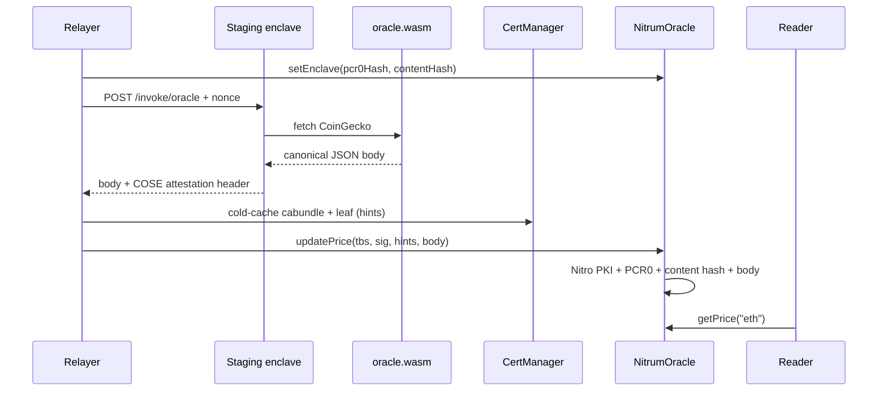

# Oracle example (enclave guest + Foundry consumer)

End-to-end demo: a WASM price oracle runs inside a nitrum-fn enclave; a relayer
posts the Nitro attestation on-chain; `NitrumOracle` verifies it (AWS Nitro PKI +
PCR0 + content hash + body hash) and stores prices.

```
examples/oracle/
  enclave/       # CoinGecko guest (.wasm) — canonical JSON body
  contracts/     # Foundry: NitrumOracle, Deploy, SetEnclave, UpdatePrices
```

Trust is **not** a Nitrum public key. It is:

1. **AWS Nitro PKI** — `CertManager` / `NitroValidator` check the COSE document is signed under the pinned AWS Nitro root CA  
2. **PCR0** — Nitro EIF / enclave image measurement (`pcr0Hash = keccak256(raw PCR0)`)  
3. **content hash** — guest `.wasm` content hash (`sha256(wasm)` = `user_data[0:32]`). **Not** AWS PCR1 — that is a different measurement.  
4. **body hash** — `user_data[32..64] == sha256(body)` so posted prices match the attestation  

Pin (2)+(3) after deploy with `setEnclave(pcr0Hash, contentHash)`.



## Attested payload

Successful invokes return **canonical, no-whitespace** JSON (USD × 1e8):

```json
{"ids":["eth"],"prices":[350012000000]}
```

Host `user_data` (64 bytes) = `sha256(wasm) || sha256(body)`.

## 0. Build guest + unit tests

```bash
cargo build --manifest-path examples/oracle/enclave/Cargo.toml \
  --target wasm32-unknown-unknown --release

cd examples/oracle/contracts
forge test
```

Local invoke has **no** Nitro document (`NoopAttestor`). On-chain submit needs **staging**.

## 1. Deploy contracts (Base Sepolia, once)

```bash
cd examples/oracle/contracts

export PRIVATE_KEY=0x…
export BASE_SEPOLIA_RPC_URL=https://sepolia.base.org

forge script script/Deploy.s.sol:Deploy \
  --rpc-url "$BASE_SEPOLIA_RPC_URL" \
  --broadcast
```

Note the printed `NitrumOracle` address. Optionally set `EXISTING_VALIDATOR` to reuse a shared `NitroValidator`.

## 2. Pin the enclave (`setEnclave`)

```bash
export ORACLE_ADDRESS=0x…
export PCR0=…   # 48-byte hex from nitrum build / eif.json
# optional: WASM_PATH=../enclave/target/.../oracle.wasm

forge script script/SetEnclave.s.sol:SetEnclave \
  --rpc-url "$BASE_SEPOLIA_RPC_URL" \
  --broadcast
```

Or pass hashes directly: `PCR0_HASH=0x…` `CONTENT_HASH=0x…` (same as `x-nitrum-fn-hash`).

```solidity
oracle.setEnclave(pcr0Hash, contentHash);
// pcr0Hash    = keccak256(48-byte PCR0)
// contentHash = sha256(oracle.wasm)  — not PCR1
```

## 3. Invoke staging (get attestation + body)

Staging only — local host uses `NoopAttestor` and will not return a Nitro document.

```bash
WASM=./examples/oracle/enclave/target/wasm32-unknown-unknown/release/oracle.wasm

# stdout = canonical JSON body; stderr includes verified attestation
cargo run -p cli -- invoke oracle --url "$INVOKE_URL" --insecure \
  -d '{"ids":["eth"]}' \
  --wasm "$WASM" \
  --pcr0 "$PCR0" \
  > body.json 2> invoke.stderr

# body → BODY_HEX
export BODY_HEX="0x$(xxd -p -c 256 body.json | tr -d '\n')"

# CLI prints `document=<base64>` after a successful --pcr0 verify
DOC_B64=$(grep -E '^[[:space:]]*document=' invoke.stderr | tail -1 | sed 's/^[[:space:]]*document=//')
export ATTESTATION_HEX="0x$(printf '%s' "$DOC_B64" | base64 -d | xxd -p -c 256 | tr -d '\n')"
```

`ATTESTATION_HEX` is the raw COSE Sign1 bytes; `BODY_HEX` must be the **exact** response bytes (no trailing newline mismatch vs what was attested).

## 4. Submit on-chain (`updatePrice`)

Needs **Node.js** for P-384 inverse hints and Foundry `--ffi`.

```bash
cd examples/oracle/contracts
export PRIVATE_KEY=0x…
export ORACLE_ADDRESS=0x…
export BASE_SEPOLIA_RPC_URL=https://sepolia.base.org
# ATTESTATION_HEX + BODY_HEX from step 3

forge script script/UpdatePrices.s.sol:UpdatePrices \
  --rpc-url "$BASE_SEPOLIA_RPC_URL" \
  --broadcast \
  --ffi
```

First submit for a new leaf chain: `CACHE_CERTS=true` (default). Later: `CACHE_CERTS=false`.

## 5. Read prices

```bash
cast call "$ORACLE_ADDRESS" "getPrice(string)(uint256)" eth \
  --rpc-url "$BASE_SEPOLIA_RPC_URL"

cast call "$ORACLE_ADDRESS" "getPriceData(string)(uint256,uint64)" eth \
  --rpc-url "$BASE_SEPOLIA_RPC_URL"
```

`350012000000` → $3500.12 (8 decimals).

## How Nitro PKI verification works

1. **Root** — `CertManager` pins the AWS Nitro root CA at deploy.  
2. **Cold path** — cabundle + leaf verified (P-384 + hints) and cached.  
3. **Warm path** — COSE document signature checked with the leaf pubkey.  
4. **Oracle policy** — PCR0, freshness, content hash, body hash, then store prices.

## Notes

- Do not rename `contentHash` to PCR1 — AWS PCR1 is unrelated.  
- Do not use attestation signature bytes as uniqueness keys (P-384 malleability).  
- Production `CertManager` owner / revoker should be multisigs.
