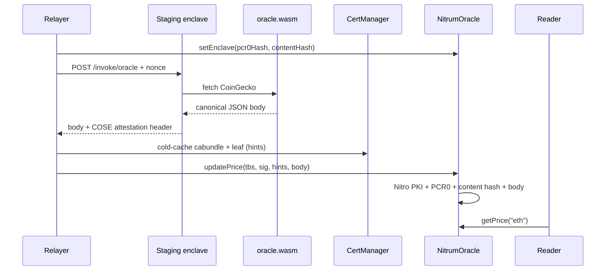

# Oracle example (enclave guest + Foundry consumer)

End-to-end: a WASM price oracle runs inside a nitrum-fn enclave; a relayer posts
the Nitro attestation on-chain; `NitrumOracle` verifies it (AWS Nitro PKI + PCR0 +
content hash + body hash) and stores prices.

Demo (deploy function → invoke → `updatePrice` → `getPrice`):

<video src="demo.mp4" controls width="100%"></video>

```
examples/oracle/
  enclave/       # CoinGecko guest (.wasm) — canonical JSON body
  contracts/     # Foundry: NitrumOracle, Deploy, SetEnclave, UpdatePrices
```

Trust is **not** a Nitrum public key. It is:

1. **AWS Nitro PKI** — `CertManager` / `NitroValidator` check the COSE document is signed under the pinned AWS Nitro root CA
2. **PCR0** — Nitro EIF / enclave image measurement (`pcr0Hash = keccak256(raw PCR0)`)
3. **content hash** — guest `.wasm` content hash (`sha256(wasm)` = `user_data[0:32]`). **Not** AWS PCR1 — that is a different measurement.
4. **body hash** — `user_data[32..64] == sha256(body)` so posted prices match the attestation

Pin (2)+(3) after deploy with `setEnclave(pcr0Hash, contentHash)`.




## Attested payload

Successful invokes return **canonical, no-whitespace** JSON (USD × 1e8):

```json
{"ids":["eth"],"prices":[350012000000]}
```

Host `user_data` (64 bytes) = `sha256(wasm) || sha256(body)`.

## 0. Build guest + unit tests

```bash
cargo build --manifest-path examples/oracle/enclave/Cargo.toml \
  --target wasm32-unknown-unknown --release

cd examples/oracle/contracts
forge test
```

Local invoke has **no** Nitro document (`NoopAttestor`). On-chain submit needs **staging**.

## 1. Deploy contracts (Base Sepolia, once)

```bash
cd examples/oracle/contracts

export PRIVATE_KEY=0x…
export BASE_SEPOLIA_RPC_URL=https://sepolia.base.org

forge script script/Deploy.s.sol:Deploy \
  --rpc-url "$BASE_SEPOLIA_RPC_URL" \
  --broadcast
```

Note the printed `NitrumOracle` address. Optionally set `EXISTING_VALIDATOR` to reuse a shared `NitroValidator`.

## 2. Pin the enclave (`setEnclave`)

Hash the guest `.wasm` first (same value as invoke `--fn-shasum` / `x-nitrum-fn-shasum`):

```bash
WASM=./examples/oracle/enclave/target/wasm32-unknown-unknown/release/oracle.wasm
HASH=$(cargo run -p cli --quiet -- describe "$WASM" | awk -F= '/^hash=/{print $2}')
```

Then pin PCR0 + content hash on-chain. The Foundry script takes hashes only:

```bash
export ORACLE_ADDRESS=0xDFFad5fe3eC475ee9F9240B3913a4002df44417E
export PCR0=0xf61799704497e58c596462482427d58dc5a39fbf1f807980fce98969c58f66820e9ae0e926f8b2d43594e3446ca42199
export CONTENT_HASH="0x$HASH"

cd examples/oracle/contracts
forge script script/SetEnclave.s.sol:SetEnclave \
  --rpc-url "$BASE_SEPOLIA_RPC_URL" \
  --broadcast
```

`PCR0_HASH=0x…` skips keccak of raw PCR0 if you already have the on-chain bytes32.

```solidity
oracle.setEnclave(pcr0Hash, contentHash);
// pcr0Hash    = keccak256(48-byte PCR0)
// contentHash = sha256(oracle.wasm)  — not PCR1
```


## 3–5. Deploy function → invoke → on-chain → read

The [demo video](demo.mp4) walks through `cli deploy`, invoke, on-chain submit, and `getPrice`.

Reference notes:

- Staging only for Nitro documents — local host uses `NoopAttestor`.
- Invoke with `--attestation-out FILE` to write the verified COSE Sign1 bytes (do not grep stderr).
- Strip trailing newlines when building `BODY_HEX` or you get `BodyHashMismatch`.
- `updatePrice` needs Node.js + `--ffi` (P-384 hints) and `--offline` (avoid Sourcify hangs).
- Prefer a dedicated Base Sepolia RPC; public endpoints often reject ~16M-gas txs.
- First leaf: `CacheCerts` with `--gas-estimate-multiplier 200`. Re-takes: skip it; `forge script UpdatePrices --ffi` then `cast send --gas-limit 16000000` (do not broadcast `updatePrice` through Foundry — local `modexp` exceeds Alchemy's 16M cap).
- `getPrice` values are USD × 1e8 (`350012000000` → $3500.12).

## How Nitro PKI verification works

1. **Root** — `CertManager` pins the AWS Nitro root CA at deploy.
2. **Cold path** — cabundle + leaf verified (P-384 + hints) and cached.
3. **Warm path** — COSE document signature checked with the leaf pubkey.
4. **Oracle policy** — PCR0, freshness, content hash, body hash, then store prices.


## Notes

- Do not rename `contentHash` to PCR1 — AWS PCR1 is unrelated.  
- Do not use attestation signature bytes as uniqueness keys (P-384 malleability).  
- Production `CertManager` owner / revoker should be multisigs.

