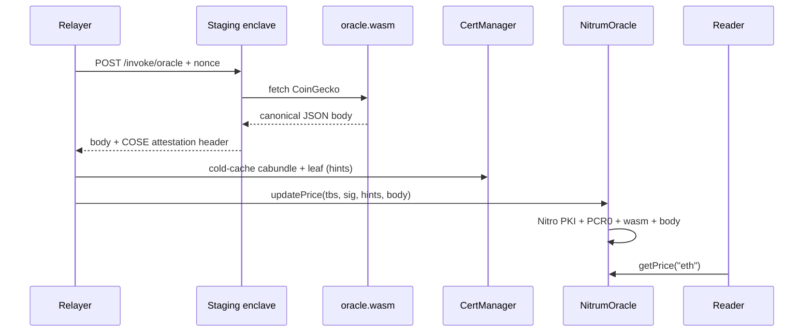

# Oracle example (enclave guest + Foundry consumer)

End-to-end demo: a WASM price oracle runs inside a nitrum-fn enclave; a relayer
posts the Nitro attestation on-chain; `NitrumOracle` verifies it (AWS Nitro PKI +
PCR0 + wasm hash + body hash) and stores prices.

```
examples/oracle/
  enclave/       # CoinGecko guest (.wasm) — canonical JSON body
  contracts/     # Foundry: NitrumOracle, Deploy, UpdatePrices
```

Trust is **not** a Nitrum public key. It is:

1. **AWS Nitro PKI** — `CertManager` / `NitroValidator` check the COSE document is signed under the pinned AWS Nitro root CA  
2. **PCR0** — constructor pin: this EIF / enclave image  
3. **wasm hash** — constructor pin: this `oracle.wasm`  
4. **body hash** — `user_data[32..64] == sha256(body)` so posted prices match the attestation  



## Attested payload

Successful invokes return **canonical, no-whitespace** JSON (USD × 1e8):

```json
{"ids":["eth"],"prices":[350012000000]}
```

Host `user_data` (64 bytes) = `sha256(wasm) || sha256(body)`.

## 0. Build guest + unit tests

```bash
cargo build --manifest-path examples/oracle/enclave/Cargo.toml \
  --target wasm32-unknown-unknown --release

cd examples/oracle/contracts
forge test
```

Local invoke has **no** Nitro document (`NoopAttestor`). On-chain submit needs **staging**.

## 1. Deploy contracts (Base Sepolia, once)

```bash
cd examples/oracle/contracts

export PRIVATE_KEY=0x…
export BASE_SEPOLIA_RPC_URL=https://sepolia.base.org
# sha256 of the published oracle.wasm
export EXPECTED_WASM_HASH=0x…
# keccak256 of the raw 48-byte PCR0 from nitrum build / eif.json
export EXPECTED_PCR0_HASH=0x…

forge script script/Deploy.s.sol:Deploy \
  --rpc-url "$BASE_SEPOLIA_RPC_URL" \
  --broadcast
```

Note the printed `NitrumOracle` address. Optionally set `EXISTING_VALIDATOR` to reuse a shared `NitroValidator`.

## 2. Invoke staging (capture attestation + body)

```bash
export INVOKE_URL=https://…   # enclave NLB
export PCR0=…                 # hex PCR0 (same image as EXPECTED_PCR0_HASH)

bash examples/oracle/contracts/script/capture.sh
```

Writes under `examples/oracle/contracts/capture/`:

- `body.json` / `body.hex` — canonical response  
- `attestation.b64` / `attestation.hex` — COSE Sign1 document  

`capture.sh` builds the wasm if needed, invokes with `--pcr0`, and extracts the CLI’s `document=` line.

Manual equivalent:

```bash
cargo run -p cli -- invoke oracle --url "$INVOKE_URL" --insecure \
  -d '{"ids":["eth"]}' \
  --wasm ./examples/oracle/enclave/target/wasm32-unknown-unknown/release/oracle.wasm \
  --pcr0 "$PCR0"
```

## 3. Submit on-chain (`updatePrice`)

Needs **Node.js** for P-384 inverse hints (`lib/nitro-validator/tools/p384_hints.js`) and Foundry `--ffi`.

```bash
cd examples/oracle/contracts
export PRIVATE_KEY=0x…
export ORACLE_ADDRESS=0x…          # from deploy
export BASE_SEPOLIA_RPC_URL=https://sepolia.base.org
# optional: ATTESTATION_HEX / BODY_HEX — otherwise reads capture/*.hex

# First submit for a new leaf chain: CACHE_CERTS=true (default)
forge script script/UpdatePrices.s.sol:UpdatePrices \
  --rpc-url "$BASE_SEPOLIA_RPC_URL" \
  --broadcast \
  --ffi
```

What the script does:

1. Splits COSE into `attestationTbs` + `signature`  
2. **Cold path** (if `CACHE_CERTS=true`): `verifyCACertWithHints` / `verifyClientCertWithHints` on the attestation’s cabundle + leaf  
3. Computes attestation signature hints  
4. Calls `oracle.updatePrice(tbs, sig, hints, body)`  

Later updates with the same cached leaf can set `CACHE_CERTS=false`.

## 4. Read prices

```bash
cast call "$ORACLE_ADDRESS" "getPrice(string)(uint256)" eth \
  --rpc-url "$BASE_SEPOLIA_RPC_URL"

cast call "$ORACLE_ADDRESS" "getPriceData(string)(uint256,uint64)" eth \
  --rpc-url "$BASE_SEPOLIA_RPC_URL"

cast call "$ORACLE_ADDRESS" "hasPrice(string)(bool)" eth \
  --rpc-url "$BASE_SEPOLIA_RPC_URL"
```

`350012000000` → $3500.12 (8 decimals).

## How Nitro PKI verification works

1. **Root** — `CertManager` pins the AWS Nitro root CA (hash + pubkey) at deploy.  
2. **Cold path** — each intermediate in `cabundle`, then the leaf, is verified (P-384 ECDSA with off-chain inverse hints that are re-checked on-chain) and cached.  
3. **Warm path** — `NitroValidator.validateAttestationWithHints` re-walks the cached chain and verifies the COSE document signature with the leaf pubkey.  
4. **Oracle policy** — `NitrumOracle` then checks PCR0, freshness, wasm hash, and body hash before storing prices.

Hints are a gas optimization only: a wrong hint reverts; it cannot forge a valid signature.

## Notes

- Do not use attestation signature bytes as uniqueness keys (P-384 malleability).  
- Production `CertManager` owner / revoker should be multisigs.  
- Operators monitor AWS CRLs off-chain and call `revokeCert` when needed.
